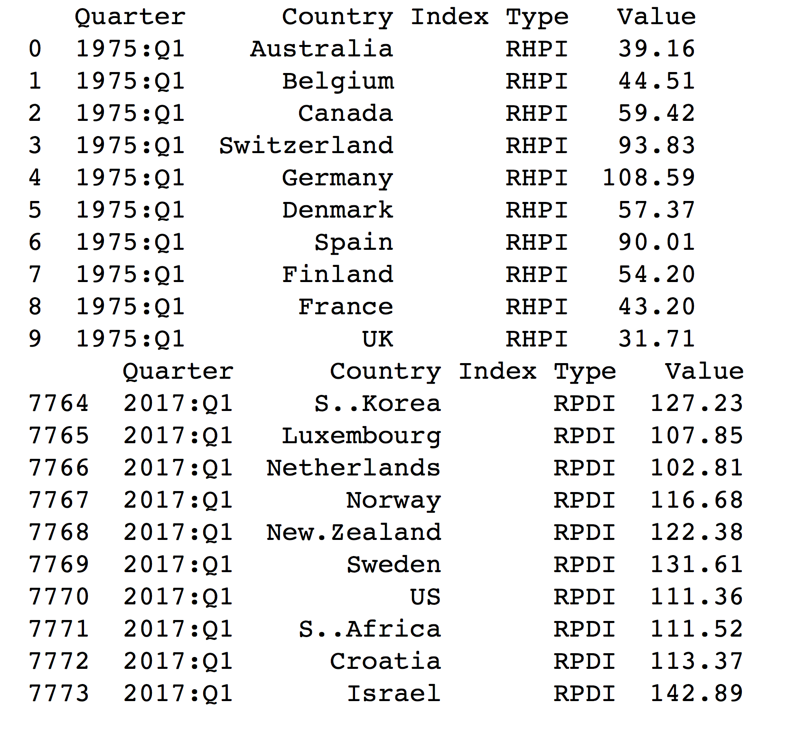

# Reshaping data in R

In this part of the assignment, we will again reshape [rhpi.csv](rhpi.csv) and [rpdi.csv](rpdi.csv), but this time we will use R to do it!

Take a look of the [assignment-2-complex-example-python.ipynb](assignment-2-complex-example-python.ipynb) and try to do the same using R. You only need to fill in the part 1-6 here. You do **not** need to do the pivot table.

You may find it useful to learn more how to use dataframe in R, read the [how-to-manipulate-dataframe.ipynb](how-to-manipulate-dataframe.ipynb).

If you get stuck somewhere, feel free to contact us! As this is a formative assignment, we are happy to give you a few lines of codes to help you to start.

## 1.  **Reshaping a simple example.**

a.  From the `cmpdata` object, replicate the reshaped object `cmpdataLong` from the lecture notes, using the **reshape2** package.  (Just use the same syntax as in the lecture notes.)

```{r}
library("reshape2")
load("cmpdata.Rdata")

cmpdataLong <- melt(cmpdata,
                    id.vars = c("countryname", "party", "date"),
                    measure.vars = names(cmpdata)[21:76],
                    variable.name = "category",
                    value.name = "catcount")
head(cmpdataLong, 30)
```

b.  Try using **tidyr** on `cmpdataLong` to "spread" this back into the wide format.

```{r}
library("tidyr")

cmpdataLong_spread <- spread(cmpdataLong, key = category, value = catcount)
View(cmpdataLong_spread)
```


## 2. Load the HPI data

a. click into the [rhpi.csv](rhpi.csv) and have a look of the data. Does it have any header? How is each entry of the data separated? by space or comma?

**It has headers. Each entries is separated by country names. It is separated by comma.**

b. take a look of the [```read.csv```](https://stat.ethz.ch/R-manual/R-devel/library/utils/html/read.table.html) function and read the csv data to r.

```{r}
rhpi <- read.csv("rhpi.csv")
```

c. after the data is loaded into r, you can use [```head```](https://stat.ethz.ch/R-manual/R-devel/library/utils/html/head.html) function to take a look of the first few rows of data. Is it in long or wide format?

```{r}
head(rhpi)
```
**The data is in wide format.**

d. you may find out that the first column name is empty. You may update the first column name to "country" by using [```colnames```](https://stat.ethz.ch/R-manual/R-devel/library/base/html/colnames.html) function. And remember R starts counting from 1!

```{r}
colnames(rhpi)[1] = "Country"
head(rhpi)
```

## 3. Convert the HPI data from wide to long

The original HPI data is in wide format. Each row represents a country and each column represents a quarter. This means that each row has the HPI values of **one** country and **different** quarters.

Here we would like to change it to long format so that each row has the a HPI value of **one** country and **one** quarter:

a. take a look of the [`melt()`](https://cran.r-project.org/web/packages/reshape2/reshape2.pdf) function and convert the the HPI data into long format. You may want to provide the following additional arguments (take a look of [http://seananderson.ca/2013/10/19/reshape.html] if you do not know how to set the arguments):
  * id
  * value.name
  * variable.name

```{r}
library("reshape2")

rhpi_long = melt(rhpi,
                id.vars = c("Country"),
                variable.name = ("Quarter"),
                value.name = ("HPI"))
```

b. use [`head()`](https://stat.ethz.ch/R-manual/R-devel/library/utils/html/head.html) to take a look of the data

```{r}
head(rhpi_long)
```

c. you will notice that the quarter value somehow has the X at the beginning (e.g. X1970.Q3 instead of 1970.Q3). If you want to remove the X from the quarter value, take a look of the [`substring()`](https://stat.ethz.ch/R-manual/R-devel/library/base/html/substr.html) function.

```{r}
rhpi_long1 <- rhpi_long
rhpi_long1[,2] <- substring(rhpi_long[,2],2,8)
head(rhpi_long1)
```

## 4. Load the PDI data and convert the PDI data from wide to long

```{r}
rpdi <-read.csv("rpdi.csv")
colnames(rpdi)[1] = "Country"
rpdi_long <- melt(rpdi,
                  id.vars = c("Country"),
                  variable.name = ("Quarter"),
                  value.name = ("PDI"))

rpdi_long1 <- rpdi_long
rpdi_long1[,2] <- substring(rpdi_long[,2],2,8)
head(rpdi_long1)
```

## 5. Merge the long format HPI and PDI data

a. take a look of the [`merge())`](https://stat.ethz.ch/R-manual/R-devel/library/base/html/merge.html) function and merge the two dataframes together. You should provide the "```by```" argument. What should be the unique identifier? Country? Quarter? Or both?

```{r}
combine = merge(rhpi_long1, rpdi_long1, by.x = c("Country","Quarter"), by.y = c("Country","Quarter"))
head(combine)
```
**Both Country and Quarter can be the unique identifier.**

b. take a look of the merged data using [`head())`](https://stat.ethz.ch/R-manual/R-devel/library/utils/html/head.html) to make sure the data are merged properly.

```{r}
head(combine)
```

## 6. Filter the data

a. take a look of the [`which())`](https://stat.ethz.ch/R-manual/R-devel/library/base/html/which.html) function. This function will return you the indices that a given condition is fulfilled.

b. filter the data so that only Australia data is shown.

c. use [`head())`](https://stat.ethz.ch/R-manual/R-devel/library/utils/html/head.html) and [`tail()`](https://stat.ethz.ch/R-manual/R-devel/library/utils/html/head.html) functions to take a look of the data to make sure you filtered the data correctly.

```{r}
new = which(combine == "Australia")
Aus = combine[new,]

head(Aus)
```

## 7. Melt the data

Try to use the `melt()` function again to produce a dataframe that is similar to this object:



```{r}
combine_long <- melt(combine,
                     id.vars = c("Quarter","Country"),
                     variable.name = ("Index Type"),
                     value.name = ("Value"))

head(combine_long)
```


